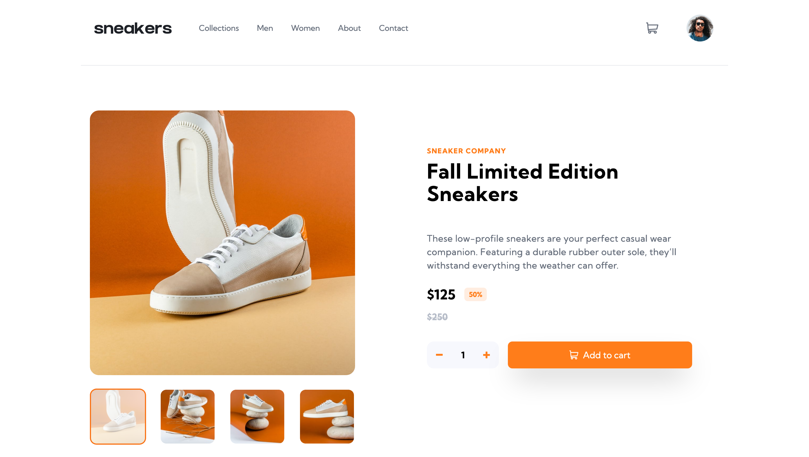

# Frontend Mentor - E-commerce product page solution

This is a solution to the [E-commerce product page challenge on Frontend Mentor](https://www.frontendmentor.io/challenges/ecommerce-product-page-UPsZ9MJp6). Frontend Mentor challenges help you improve your coding skills by building realistic projects.

## Table of contents

- [Overview](#overview)
  - [The challenge](#the-challenge)
  - [Screenshot](#screenshot)
  - [Links](#links)
- [My process](#my-process)
  - [Built with](#built-with)
- [Author](#author)

## Overview

### The challenge

Users should be able to:

- View the optimal layout for the site depending on their device's screen size
- See hover states for all interactive elements on the page
- Open a lightbox gallery by clicking on the large product image
- Switch the large product image by clicking on the small thumbnail images
- Add items to the cart
- View the cart and remove items from it

### Screenshot

### Links

- [Solution URL](https://github.com/tombatossals/frontendmentor-challenges/tree/main/ecommerce-product-page-main)
- [Live Site URL](https://tombatossals.github.io/frontendmentor-challenges/ecommerce-product-page-main)

## My process

### Built with

- Semantic HTML5 markup
- TailwindCSS
- Vue3
- Flexbox
- Mobile-first workflow

## Author

- Website - [tombatossals](https://github.com/tombatossals/frontendmentor-challenges)
- Frontend Mentor - [@tombatossals](https://www.frontendmentor.io/profile/tombatossals)
- Twitter - [@tombatossals](https://www.twitter.com/tombatossals)
