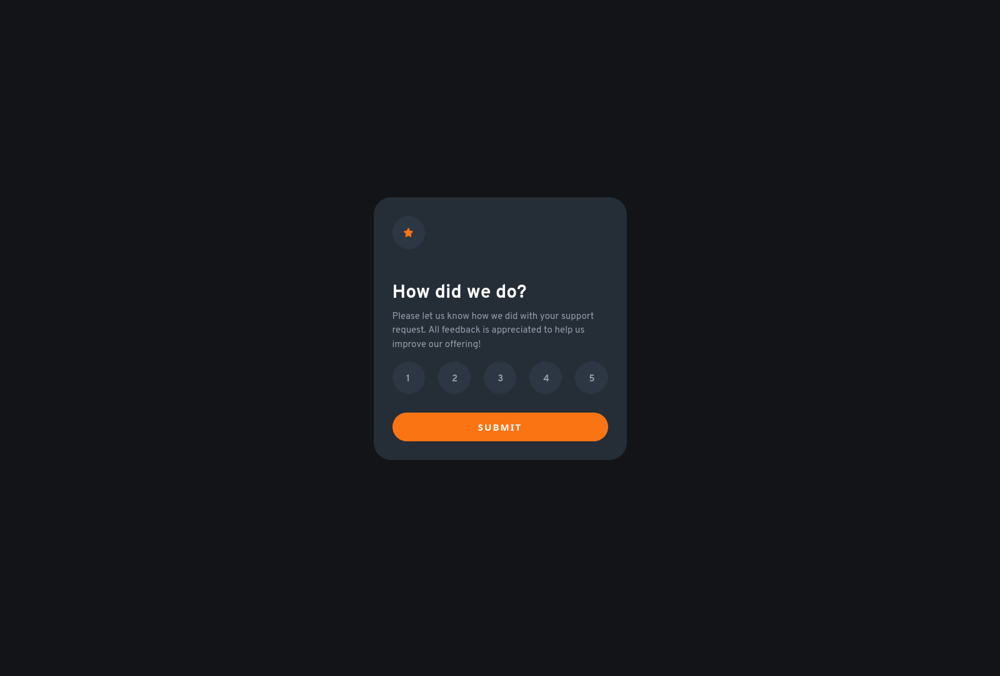

# Frontend Mentor - Interactive rating component solution

This is a solution to the [Interactive rating component challenge on Frontend Mentor](https://www.frontendmentor.io/challenges/interactive-rating-component-koxpeBUmI). Frontend Mentor challenges help you improve your coding skills by building realistic projects. 

## Table of contents

- [Overview](#overview)
  - [The challenge](#the-challenge)
  - [Screenshot](#screenshot)
  - [Links](#links)
- [My process](#my-process)
  - [Built with](#built-with)
  - [What I learned](#what-i-learned)
  - [Continued development](#continued-development)
  - [Useful resources](#useful-resources)
- [Author](#author)
- [Acknowledgments](#acknowledgments)

## Overview

### The challenge

Users should be able to:

- View the optimal layout for the app depending on their device's screen size
- See hover states for all interactive elements on the page
- Select and submit a number rating
- See the "Thank you" card state after submitting a rating

### Screenshot

### Links

- Solution URL: [here](https://github.com/tombatossals/frontendmentor-challenges/tree/main/interactive-rating-component-main)
- Live Site URL: [here](https://tombatossals.github.io/frontendmentor-challenges/interactive-rating-component-main)

## My process

### Built with

- Plain CSS with BEM methodology.
- Vue.JS

### What I learned

* BEM
* My first steps with Vue.JS

### Useful resources

- [Battling BEM CSS](https://www.smashingmagazine.com/2016/06/battling-bem-extended-edition-common-problems-and-how-to-avoid-them/) - Useful article about how and when to use BEM CSS methodology.

**Note: Delete this note and replace the list above with resources that helped you during the challenge. These could come in handy for anyone viewing your solution or for yourself when you look back on this project in the future.**

## Author

- Website - [tombatossals](https://github.com/tombatossals/frontendmentor-challenges)
- Frontend Mentor - [@tombatossals](https://www.frontendmentor.io/profile/tombatossals)
- Twitter - [@tombatossals](https://www.twitter.com/tombatossals)

**Note: Delete this note and add/remove/edit lines above based on what links you'd like to share.**

## Acknowledgments

This is where you can give a hat tip to anyone who helped you out on this project. Perhaps you worked in a team or got some inspiration from someone else's solution. This is the perfect place to give them some credit.

**Note: Delete this note and edit this section's content as necessary. If you completed this challenge by yourself, feel free to delete this section entirely.**
