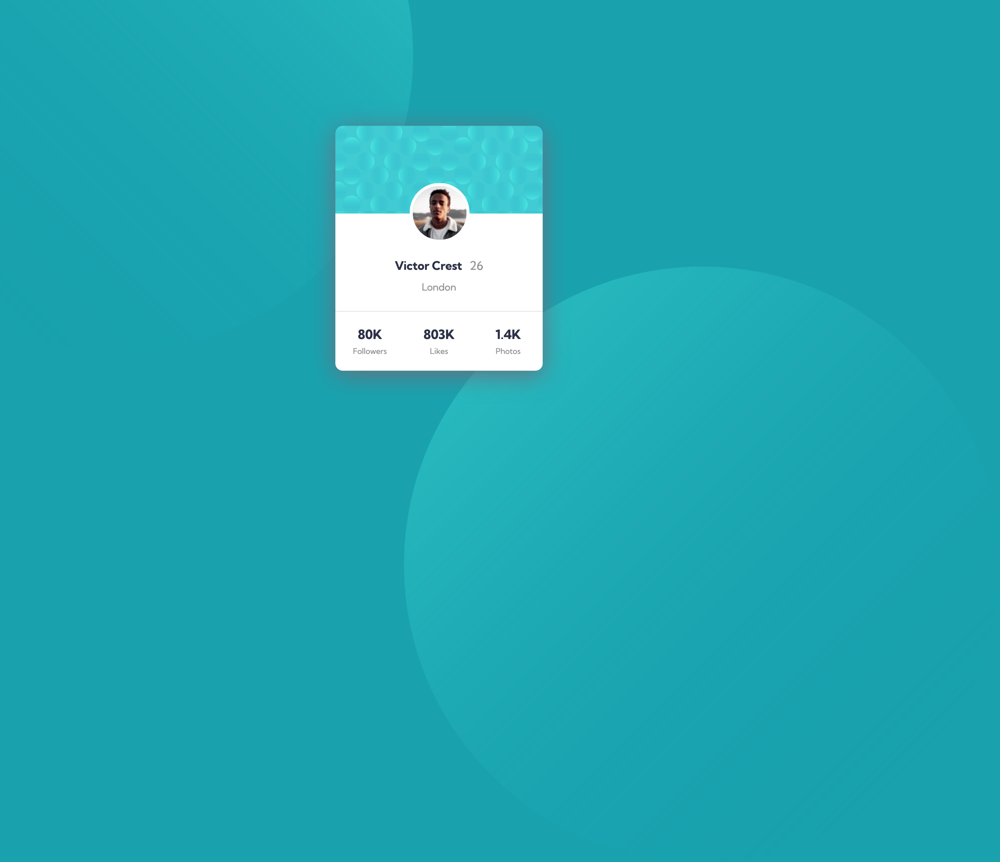

# Frontend Mentor - Profile card component solution

This is a solution to the [Profile card component challenge on Frontend Mentor](https://www.frontendmentor.io/challenges/profile-card-component-cfArpWshJ). Frontend Mentor challenges help you improve your coding skills by building realistic projects.

## Table of contents

- [Overview](#overview)
  - [The challenge](#the-challenge)
  - [Screenshot](#screenshot)
  - [Links](#links)
- [My process](#my-process)
  - [Built with](#built-with)
  - [What I learned](#what-i-learned)
  - [Continued development](#continued-development)
  - [Useful resources](#useful-resources)
- [Author](#author)
- [Acknowledgments](#acknowledgments)

## Overview

### The challenge

- Build out the project to the designs provided

### Screenshot

Add a screenshot of your solution. The easiest way to do this is to use Firefox to view your project, right-click the page and select "Take a Screenshot". You can choose either a full-height screenshot or a cropped one based on how long the page is. If it's very long, it might be best to crop it.

Alternatively, you can use a tool like [FireShot](https://getfireshot.com/) to take the screenshot. FireShot has a free option, so you don't need to purchase it.

Then crop/optimize/edit your image however you like, add it to your project, and update the file path in the image above.

### Links

- Solution URL: [Add solution URL here](https://github.com/tombatossals/frontendmentor-challenges/tree/main/profile-card-component-main)
- Live Site URL: [Add live site URL here](https://tombatossals.github.io/frontendmentor-challenges/profile-card-component-main)

## My process

### Built with

- Semantic HTML5 markup
- CSS custom properties
- Flexbox

## Author

- Website - [tombatossals](https://github.com/tombatossals/frontendmentor-challenges)
- Frontend Mentor - [@tombatossals](https://www.frontendmentor.io/profile/tombatossals)
- Github - [tombatossals](https://github.com/tombatossals)
