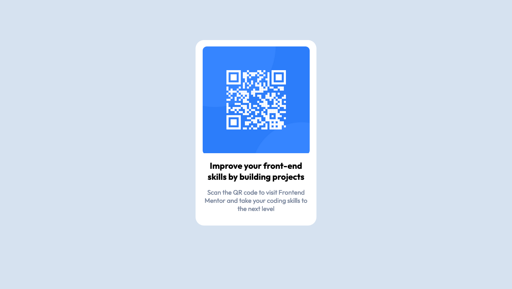

# Frontend Mentor - QR code component solution

This is a solution to the [QR code component challenge on Frontend Mentor](https://www.frontendmentor.io/challenges/qr-code-component-iux_sIO_H). Frontend Mentor challenges help you improve your coding skills by building realistic projects. 

## Table of contents

- [Overview](#overview)
  - [Screenshot](#screenshot)
  - [Links](#links)
- [My process](#my-process)
  - [Built with](#built-with)
  - [What I learned](#what-i-learned)
  - [Continued development](#continued-development)
  - [Useful resources](#useful-resources)
- [Author](#author)
- [Acknowledgments](#acknowledgments)

## Overview

### Screenshot

### Links

- Solution URL: [here](https://github.com/tombatossals/frontendmentor-challenges/tree/main/qr-code-component-main)
- Live Site URL: [here](https://tombatossals.github.io/frontendmentor-challenges/qr-code-component-main)

## My process

### Built with

- Vanilla CSS

### Useful resources

- [Example resource 1](https://www.example.com) - This helped me for XYZ reason. I really liked this pattern and will use it going forward.
- [Example resource 2](https://www.example.com) - This is an amazing article which helped me finally understand XYZ. I'd recommend it to anyone still learning this concept.

## Author

- Website - [tombatossals](https://github.com/tombatossals/frontendmentor-challenges)
- Frontend Mentor - [@tombatossals](https://www.frontendmentor.io/profile/tombatossals)
- Github - [tombatossals](https://github.com/tombatossals)
