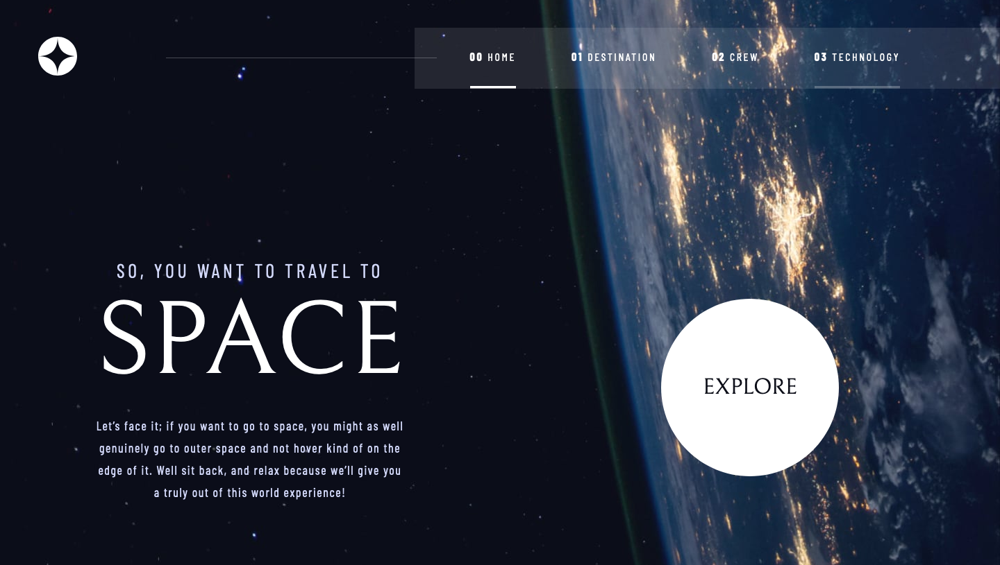

# Frontend Mentor - Space tourism website solution

This is a solution to the [Space tourism website challenge on Frontend Mentor](https://www.frontendmentor.io/challenges/space-tourism-multipage-website-gRWj1URZ3). Frontend Mentor challenges help you improve your coding skills by building realistic projects.

## Table of contents

- [Overview](#overview)
  - [The challenge](#the-challenge)
  - [Screenshot](#screenshot)
  - [Links](#links)
- [My process](#my-process)
  - [Built with](#built-with)
  - [What I learned](#what-i-learned)
  - [Useful resources](#useful-resources)
- [Author](#author)

## Overview

### The challenge

Users should be able to:

- View the optimal layout for each of the website's pages depending on their device's screen size
- See hover states for all interactive elements on the page
- View each page and be able to toggle between the tabs to see new information

### Screenshot

### Links

- [Solution URL](https://github.com/tombatossals/frontendmentor-challenges/tree/main/space-tourism-website-main)
- [Live Site URL](https://tombatossals.github.io/frontendmentor-challenges/space-tourism-website-main)

## My process

### Built with

- NuxtJS3

### What I learned

- Vue3
- NuxtJS3
- Media queries development for different screen sizes

### Useful resources

- [Perfect full page background image](https://css-tricks.com/perfect-full-page-background-image/)

## Author

- Website - [tombatossals](https://github.com/tombatossals/frontendmentor-challenges)
- Frontend Mentor - [@tombatossals](https://www.frontendmentor.io/profile/tombatossals)
- Github - [tombatossals](https://github.com/tombatossals)
